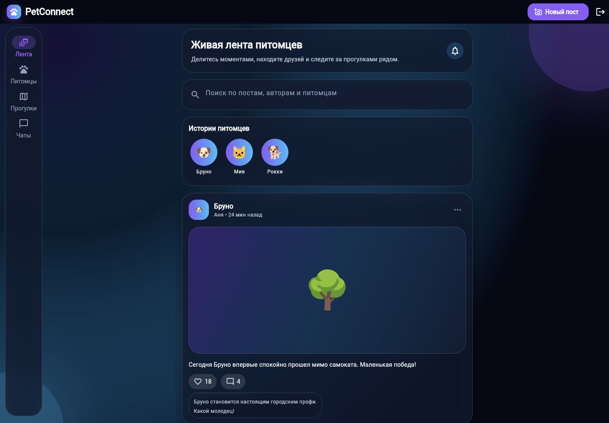
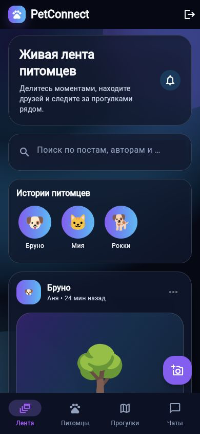

# PetConnect

PetConnect is a full-stack Flutter Web application for pet owners. It combines pet profiles, a social feed, likes, comments, walks, basic chat, image upload, analytics, monitoring and a documented AI-assisted development workflow.

The project is prepared as a portfolio project and final course work for "Разработка полнофункционального веб-приложения с использованием AI-агентов".

## Links

| Resource | URL |
|---|---|
| Production app | https://cool-duckanoo-d28d04.netlify.app |
| Health check | https://cool-duckanoo-d28d04.netlify.app/api/health |
| GitHub repository | https://github.com/SofrikX/otus_hw4/tree/hw5-sb |
| Submission package | [docs/submission_package.md](docs/submission_package.md) |
| Defense script | [docs/defense_script.md](docs/defense_script.md) |
| Final release checklist | [final_release_checklist.md](final_release_checklist.md) |

The production frontend is hosted on Netlify. Runtime data is served by Supabase Auth, PostgreSQL, Row Level Security, Storage and auto REST API.

## Key Features

- Supabase email/password authentication and Google OAuth through Supabase Auth.
- Protected Flutter routes with `go_router` and Riverpod auth state.
- Pet social feed with post creation, likes, comments, search and owner-only post deletion.
- Pet profiles with create, read, update, delete and Supabase Storage photo upload.
- Walk discovery with create, join, leave and filters by date, location and status.
- Pet search by name and animal type.
- Basic chat screen and chat/message schema.
- Premium dark responsive UI with mobile bottom navigation and desktop navigation rail.
- Loading, empty, error and success states for core async flows.
- Yandex Metrica analytics with privacy-safe event params.
- Netlify health endpoint and structured sanitized logs.
- GitHub Actions CI/CD with security gate, formatting, analysis, tests, web build and Netlify deploy.

## Final Visual Redesign

The final portfolio UI uses a premium dark pet social app style:

- deep navy/black background;
- violet/blue gradient accents;
- glassmorphism cards and polished form surfaces;
- redesigned auth landing, feed, pets, walks, pet profile and chat screens;
- responsive mobile and desktop layouts;
- shared loading, empty and error components aligned with the final design system.

The redesign preserved routing, Supabase integration, Riverpod controllers, repository boundaries, CRUD flows, analytics and tests.

## Screenshots

Current screenshots are stored in [docs/screenshots](docs/screenshots). App screenshots were refreshed after the final premium dark visual redesign and use demo/mock-safe UI data without credentials or private dashboard values.

| View | Screenshot |
|---|---|
| Desktop feed, 1440 x 1000 |  |
| Mobile feed, 390 x 844 |  |
| Auth desktop | [docs/screenshots/01_landing_auth_desktop.png](docs/screenshots/01_landing_auth_desktop.png) |
| Create post desktop | [docs/screenshots/03_create_post_desktop.png](docs/screenshots/03_create_post_desktop.png) |
| Pets desktop | [docs/screenshots/04_pets_desktop.png](docs/screenshots/04_pets_desktop.png) |
| Pet photo upload desktop | [docs/screenshots/05_pet_image_upload_desktop.png](docs/screenshots/05_pet_image_upload_desktop.png) |
| Walks desktop | [docs/screenshots/06_walks_desktop.png](docs/screenshots/06_walks_desktop.png) |
| Active filters desktop | [docs/screenshots/07_search_filters_desktop.png](docs/screenshots/07_search_filters_desktop.png) |
| Auth mobile | [docs/screenshots/08_mobile_auth.png](docs/screenshots/08_mobile_auth.png) |

Screenshot capture checklist and privacy rules are documented in [docs/screenshots/README.md](docs/screenshots/README.md).

## Demo Flow

Recommended reviewer flow:

1. Open the production app.
2. Sign in or register with a demo account configured outside the repository.
3. Confirm the feed loads posts.
4. Create a pet profile.
5. Upload a pet photo under 5 MB.
6. Create a post for an owned pet.
7. Like and comment on a post.
8. Search the feed.
9. Open Pets and use name/type filters.
10. Open Walks, create a walk and join/leave a walk.
11. Open Chat to review the basic chat scenario.
12. Check `/api/health`.
13. Repeat a quick visual pass on mobile and desktop viewports.

Do not publish demo passwords, OAuth secrets, Supabase service keys or private user data in screenshots or documentation.

## Tech Stack

| Layer | Technology |
|---|---|
| Frontend | Flutter Web, Dart, Material 3 |
| State management | Riverpod / `flutter_riverpod` |
| Routing | `go_router` |
| Architecture | Feature-first folders, repository layer, Clean Architecture principles |
| Auth | Supabase Auth, Google OAuth through Supabase |
| Database | Supabase PostgreSQL |
| Security | Row Level Security, Storage policies, CI security gate |
| Storage | Supabase Storage |
| API | Supabase auto REST API / `supabase_flutter` |
| Hosting | Netlify |
| CI/CD | GitHub Actions, Netlify CLI |
| Analytics | Yandex Metrica |
| Monitoring | Netlify Function `/api/health`, structured logs |
| Tests | `flutter_test`, `mocktail` |
| AI agent | OpenAI Codex |

## Architecture Overview

```text
Flutter UI
  -> Riverpod controllers/providers
  -> repository interfaces
  -> Supabase or mock repository implementations
  -> supabase_flutter client
  -> Supabase Auth / PostgREST / Storage
  -> PostgreSQL tables protected by RLS
```

Source layout:

```text
lib/
  app/                 # app shell, router, theme, startup fallback
  core/                # config, analytics, logging, network, Supabase, shared widgets
  features/
    auth/              # auth repository, controller, login/register UI
    feed/              # posts, likes, comments, feed controller/UI
    pets/              # pet profiles, photo upload, repositories/providers/UI
    walks/             # walk list, create/join/leave flows
    chat/              # basic chat UI and domain model
    home/              # responsive app shell/navigation
```

UI widgets do not call Supabase directly. Screens call Riverpod controllers/providers, controllers use repository interfaces, and repository implementations decide between Supabase and mock mode.

## Backend Model

Database source of truth:

```text
supabase/migrations/001_initial_schema.sql
supabase/migrations/002_rls_policies.sql
supabase/migrations/003_api_grants.sql
supabase/migrations/004_pet_images_storage.sql
supabase/migrations/005_harden_remote_rls_policies.sql
supabase/migrations/006_fix_pet_images_storage_policy_path.sql
```

Core tables:

- `profiles`
- `pets`
- `posts`
- `comments`
- `post_likes`
- `walks`
- `walk_participants`
- `chats`
- `chat_participants`
- `messages`

Storage buckets:

- `pet-images` for visible pet profile photos;
- `avatars`, `pet-photos`, `post-images` as prepared or historical buckets.

RLS summary:

- users manage only their own profiles, pets, posts, likes, comments and walk participation rows;
- post creation requires the selected pet to belong to the current user;
- private/deleted posts are not exposed through comments and likes;
- walk joins require active walks;
- chat visibility is participant-scoped;
- `pet-images` writes are authenticated and owner/pet-scoped.

## Local Setup

Prerequisites:

- Flutter stable with Web support;
- Chrome for web runs;
- Supabase CLI only when validating migrations locally.

Install dependencies:

```bash
flutter pub get
```

Run in mock mode without Supabase credentials:

```bash
flutter run -d chrome \
  --dart-define=USE_SUPABASE_BACKEND=false \
  --dart-define=ANALYTICS_ENABLED=false
```

Run with Supabase:

```bash
flutter run -d chrome \
  --dart-define=USE_SUPABASE_BACKEND=true \
  --dart-define=SUPABASE_URL=<your-supabase-url> \
  --dart-define=SUPABASE_PUBLISHABLE_KEY=<your-supabase-publishable-key> \
  --dart-define=SUPABASE_AUTH_REDIRECT_URL=http://localhost:3000/ \
  --dart-define=ANALYTICS_ENABLED=false
```

If platform files are missing:

```bash
flutter create . --platforms=web,android,ios
```

## Environment Variables

Use real values only in local shell, ignored env files, Netlify UI or GitHub settings. Do not commit them.

| Variable | Required | Notes |
|---|---:|---|
| `USE_SUPABASE_BACKEND` | yes | `true` for Supabase mode, `false` for mock mode |
| `SUPABASE_URL` | Supabase mode | Public Supabase project URL |
| `SUPABASE_PUBLISHABLE_KEY` | Supabase mode | Public browser client key; not a service role key |
| `SUPABASE_AUTH_REDIRECT_URL` | OAuth | Exact local or production redirect URL |
| `ANALYTICS_ENABLED` | optional | `true` or `false` |
| `ANALYTICS_PROVIDER` | analytics | Current value: `yandex_metrica` |
| `YANDEX_METRICA_COUNTER_ID` | analytics | Public counter id, never hardcode in repo |
| `APP_VERSION` | optional | Used by Netlify health endpoint |

Never use Supabase service role keys, database passwords, JWT secrets, Google Client Secret or private access tokens in Flutter Web build arguments.

## Supabase Setup Notes

1. Create a Supabase Free Tier project.
2. Copy the Project URL as `SUPABASE_URL`.
3. Copy the publishable key as `SUPABASE_PUBLISHABLE_KEY`.
4. Enable email/password Auth.
5. Enable Google OAuth in Supabase Dashboard if OAuth demo is required.
6. Set exact redirect URLs:

```text
https://cool-duckanoo-d28d04.netlify.app/
http://localhost:3000/
http://127.0.0.1:3000/
```

7. Apply migrations:

```bash
supabase login
supabase link --project-ref <your-project-ref>
supabase db push
```

8. Validate RLS:

```bash
supabase db lint
supabase db reset
```

If Supabase CLI is unavailable, run SQL files from `supabase/migrations/` in order through Supabase SQL Editor and document manual validation.

Google Client Secret belongs only in Supabase Dashboard and Google Cloud Console. It must not appear in Dart code, Netlify variables, GitHub Actions, README, screenshots or commits.

## Netlify Deployment

`netlify.toml` builds and publishes Flutter Web:

```bash
flutter build web --release \
  --dart-define=USE_SUPABASE_BACKEND=true \
  --dart-define=SUPABASE_URL=$SUPABASE_URL \
  --dart-define=SUPABASE_PUBLISHABLE_KEY=$SUPABASE_PUBLISHABLE_KEY \
  --dart-define=SUPABASE_AUTH_REDIRECT_URL=https://cool-duckanoo-d28d04.netlify.app/ \
  --dart-define=ANALYTICS_ENABLED=$ANALYTICS_ENABLED \
  --dart-define=ANALYTICS_PROVIDER=$ANALYTICS_PROVIDER \
  --dart-define=YANDEX_METRICA_COUNTER_ID=$YANDEX_METRICA_COUNTER_ID
```

Publish directory:

```text
build/web
```

Netlify routes:

- `/api/health` -> `/.netlify/functions/health`;
- `/*` -> `/index.html` for Flutter Web SPA routing.

Netlify environment variables:

```text
SUPABASE_URL=<your-supabase-url>
SUPABASE_PUBLISHABLE_KEY=<your-supabase-publishable-key>
ANALYTICS_ENABLED=true
ANALYTICS_PROVIDER=yandex_metrica
YANDEX_METRICA_COUNTER_ID=<your-yandex-metrica-counter-id>
APP_VERSION=<optional-release-version-or-commit-sha>
```

`SECRETS_SCAN_OMIT_KEYS` includes only public browser configuration keys: `SUPABASE_URL`, `SUPABASE_PUBLISHABLE_KEY`, `YANDEX_METRICA_COUNTER_ID`.

## CI/CD

Workflow: `.github/workflows/ci_cd.yml`.

Pull requests run:

- security audit job;
- `flutter pub get`;
- `flutter pub outdated`;
- repository hygiene checks for `.env*` and `.DS_Store`;
- secret marker scan for executable/configuration paths;
- `dart format --set-exit-if-changed .`;
- `flutter analyze`;
- `flutter test`;
- Flutter Web release build.

Pushes to `main` also deploy `build/web` to Netlify with Netlify CLI.

Required GitHub Actions secrets:

- `NETLIFY_AUTH_TOKEN`
- `NETLIFY_SITE_ID`
- `SUPABASE_URL`
- `SUPABASE_PUBLISHABLE_KEY`

Required GitHub Actions variables:

- `ANALYTICS_ENABLED`
- `ANALYTICS_PROVIDER`
- `YANDEX_METRICA_COUNTER_ID`

## Testing

Run before handoff:

```bash
flutter pub get
dart format --set-exit-if-changed .
flutter analyze
flutter test
flutter build web --release \
  --dart-define=USE_SUPABASE_BACKEND=false \
  --dart-define=ANALYTICS_ENABLED=false
```

Latest local validation:

```text
flutter pub get: passed
dart format --set-exit-if-changed .: passed, 99 files checked, 0 changed
flutter analyze: passed, no issues found
flutter test: passed, 110 tests
flutter build web --release --dart-define=USE_SUPABASE_BACKEND=false --dart-define=ANALYTICS_ENABLED=false: passed
```

Manual QA is tracked in [docs/manual_qa_checklist.md](docs/manual_qa_checklist.md). Test strategy is documented in [docs/testing_strategy.md](docs/testing_strategy.md).

## Security And Privacy

- No service role key, database password, JWT secret, Google Client Secret or private token belongs in the repository.
- `.env.example` is the only env file intended to be tracked.
- Supabase publishable key is public browser configuration; RLS and Storage policies are the data security boundary.
- Analytics uses coarse event params only. It must not receive email, raw ids, names, post/comment text, search text, tokens or secrets.
- Logs are structured and sanitized through `AppLogger` and Netlify health logs.
- Flutter release mode skips info logs.
- `/api/health` returns status metadata only and does not expose environment values.
- Full findings are documented in [security_audit.md](security_audit.md).

## Project Documentation

| Document | Purpose |
|---|---|
| [project_documentation.md](project_documentation.md) | Product overview, scope, architecture and requirement coverage |
| [user_stories.md](user_stories.md) | Final user stories and acceptance criteria |
| [technical_specification.md](technical_specification.md) | Technical specification for Flutter Web + Supabase |
| [backend_documentation.md](backend_documentation.md) | Supabase schema, RLS, Storage and API documentation |
| [integration_documentation.md](integration_documentation.md) | OAuth, CI/CD, Netlify, analytics and health check |
| [security_audit.md](security_audit.md) | Final security and performance audit |
| [final_release_checklist.md](final_release_checklist.md) | Final release and submission checklist |
| [docs/testing_strategy.md](docs/testing_strategy.md) | Automated and manual testing strategy |
| [docs/manual_qa_checklist.md](docs/manual_qa_checklist.md) | Manual production QA checklist |
| [docs/ui_ux_audit.md](docs/ui_ux_audit.md) | UI/UX and responsive audit |
| [docs/screenshots/README.md](docs/screenshots/README.md) | Screenshot checklist and capture rules |
| [docs/submission_package.md](docs/submission_package.md) | Final submission package summary |
| [docs/defense_script.md](docs/defense_script.md) | Defense talk track, demo flow and Q&A |
| [ai_development_process.md](ai_development_process.md) | AI-assisted development process |
| [development_report.md](development_report.md) | Development report and change history |
| [prompts.md](prompts.md) | Prompt journal and AI results |

## AI-Assisted Development

OpenAI Codex was used as product analyst, Flutter/Supabase engineer, QA reviewer, security auditor and technical writer.

Codex assisted with:

- requirements analysis and final project packaging;
- user stories and technical specification;
- Supabase schema, RLS and Storage design;
- Flutter repository/controller integration;
- Google OAuth, Netlify, CI/CD, analytics and health check documentation;
- security/performance review;
- final visual redesign;
- tests, debugging and release documentation.

The AI workflow is documented in [ai_development_process.md](ai_development_process.md), [development_report.md](development_report.md) and [prompts.md](prompts.md).
